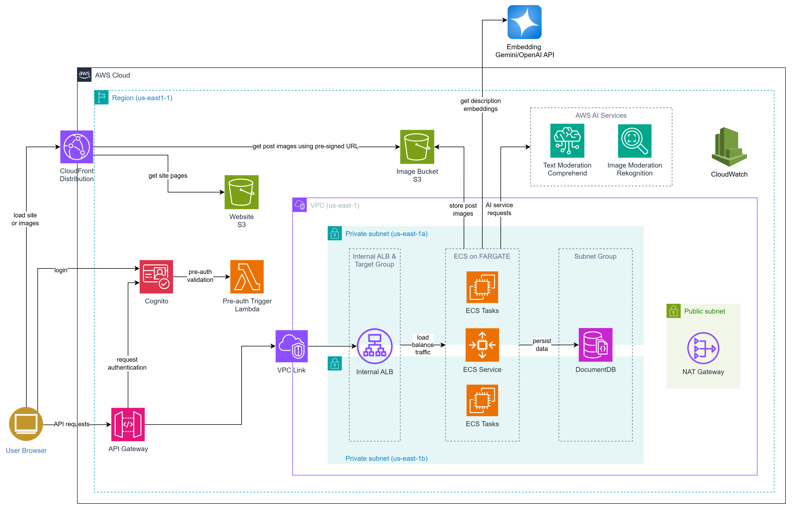
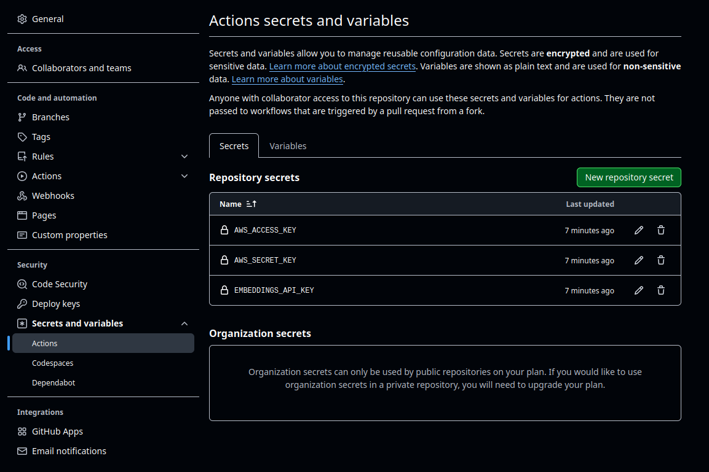
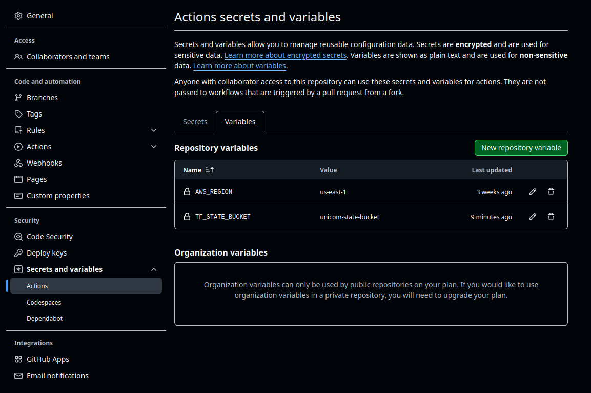

# Uni-Com: User’s Guide

**Purpose:** This standalone guide walks developers or testers through deploying, configuring, and using the Uni-Com application.

## Architecture

This project follows a Model-View-Controller (MVC) design pattern and utilizes various AWS services to enable a scalable, secure, and AI-integrated platform. The architecture is divided into three main components:

### User Authentication and Verification

#### AWS Cognito
- Handles **user registration and authentication**.
- Uses a **Cognito User Pool** to manage user credentials and metadata.
- A **pre-signup Lambda trigger** checks if the email belongs to the `@rit.edu` domain. Invalid emails are rejected during sign-up.

#### Pre-Signup Lambda Trigger
- A **serverless Lambda function** that validates if the user email is an RIT email before allowing sign-up.

#### API Gateway
- Acts as the **API layer** between frontend and backend.
- Handles token-based **authentication** and routes requests for creating, updating, and deleting posts.

#### Backend API in Docker
- Dockerized Python 3.12 backend application.
- Requirements installed and **CA certificate bundle** added for secure DocumentDB connections.
- Exposes the application on port `8080`.

### Content Delivery and AI Moderation

#### CloudFront & S3
- **Amazon CloudFront** distributes static content (HTML, JS, CSS) from **S3** with low latency.
- Users access images via **temporary pre-signed S3 URLs**.

#### AWS Comprehend (Text Moderation)
- Scans user-submitted post descriptions for offensive or inappropriate text.
- Approved content is stored in the database.

#### AWS Rekognition (Image Moderation)
- Analyzes uploaded images to detect **unsafe, explicit, or violent content**.
- Images passing moderation are allowed in posts.

#### Gemini / OpenAI Embedding API
- Converts text descriptions into **semantic vector embeddings**.
- Enables **context-aware semantic search** based on vector similarity.

### Backend Architecture

#### Virtual Private Cloud (VPC)
- Isolated cloud network with the following setup (configurable):
  - CIDR Block: `10.0.0.0/16`
  - **2 Private Subnets**: `10.0.4.0/24`, `10.0.5.0/24`
  - **2 Public Subnets**: `10.0.1.0/24`, `10.0.2.0/24`
  - Availability Zones: `us-east-2a`, `us-east-2b`
- **DocumentDB** is hosted in a private subnet for security.

#### NAT Gateways
- Located in public subnets to allow **private subnets** to access the internet securely.

#### Internal Application Load Balancer (ALB)
- Balances internal traffic between API Gateway and ECS tasks.
- VPC Link enables traffic ingress from API Gateway to the internal ALB.

#### ECS on Fargate
- Backend is deployed using **AWS Fargate** to eliminate the need for server provisioning.
- **Task Definition**:
  - Specifies container details like image URI, resources, and environment variables.
- **ECS Service**:
  - Manages task lifecycle and autoscaling based on **CPU and memory utilization**.

#### DocumentDB (MongoDB-Compatible)
- Used for storing user information and post content.
- Selected over DynamoDB to support **vector indexing** for semantic search.

<!-- ---

## Table of Contents
1. [Prerequisites](#1-prerequisites)
2. [Initial Setup](#2-initial-setup)
   1. [AWS Credentials & CLI](#21-configure-aws-credentials)
   2. [Local Environment Variables](#22-local-environment-variables)
3. [Deployment via GitHub Actions & Terraform](#3-deployment)
   1. [Workflow Overview](#31-workflow-overview)
   2. [Setup Action](#32-setup-action)
   3. [Teardown Action](#33-teardown-action)
4. [External Resources & Seed Data](#4-external-resources)
5. [Using the Application](#5-using-the-application)
   1. [Web App Tour](#51-web-app-tour)
   2. [Key Features & Scenarios](#52-key-features)
6. [Troubleshooting](#6-troubleshooting)
7. [Appendix](#7-appendix) -->

## Initial Setup
Before deploying the application via GitHub Actions, users must complete an initial setup that includes configuring GitHub secrets and variables. This setup ensures secure access to AWS resources and proper configuration of the deployment environment.

### Note: Use `main` branch for deployment. 

### AWS S3 bucket for state files
To ensure a clean deployment and teardown of the project infrastructure, it is essential to store Terraform state files in an S3 bucket during the deployment (terraform apply) stage. Without storing the state files, any infrastructure provisioned during deployment cannot be properly destroyed using the GitHub Actions Terraform destroy workflow.

To create an empty S3 bucket for this purpose, follow these steps:
* Log in to the AWS Management Console.
* Navigate to the S3 service dashboard.
* Click the Create bucket button.
* Enter a unique name for the bucket.
* Click Create bucket to finalize creation.
* Record the bucket name, as it will be required when setting up GitHub Variables.

### GitHub Secrets
For successful deployment, the following GitHub secrets must be created:

| Secret Name | Description |
|-------------|-------------|
| `AWS_ACCESS_KEY` | The access key for your AWS IAM user with appropriate deployment permissions |
| `AWS_SECRET_KEY` | The secret access key paired with your AWS access key ID |
| `EMBEDDINGS_API_KEY` | The API key used for embedding service authentication (provided to the user) |

To create each secret follow the steps listed below : 
1. Navigate to the project's GitHub repository
2. Click on `Settings` → `Secrets and variables` → `Actions`
3. Select `New repository secret`
4. Enter the secret name and value
5. Click `Add secret`

***NOTE:*** The embeddings API key will be proided to the user

### GitHub Variables
For successful deployment, the following GitHub variables must be created:

| Variable Name | Description |
|---------------|-------------|
| `AWS_REGION` | The AWS region where your resources will be deployed (e.g., `us-east-1`) |
| `TF_STATE_BUCKET` | The S3 bucket name for storing Terraform state files. User must have this bucket already created in their AWS backend |

To create each variable follow the steps listed below : 
1. Navigate to the project's GitHub repository
2. Click on `Settings` → `Secrets and variables` → `Actions`
3. Select the `Variables` tab
4. Click `New repository variable`
5. Enter the variable name and value
6. Click `Add variable`

***NOTE:*** For `TF_STATE_BUCKET` make sure to use the same name given to the S3 bucket created in step 1 (AWS S3 bucket for state files)

---

## Deployment via GitHub Actions & Terraform

### Workflow Overview
This project repository includes a **single reusable workflow** (`Deploy Uni-Com`)  which can be triggered manually through GitHub Actions. The workflow description is provided in `.github/workflows/main.yml`. 

Deploy Uni-Com contains 2 job descriptions :
* **Terraform_apply** – provisions all AWS resources, builds the frontend and deploys the application.
* **Terraform_destroy** – tears down the provisioned infrastructure.

### Setup Action
Before running Actions workflow, ensure all GitHub secrets and variables are properly configured. To deploy the application, follow the steps listed below :
1. On the Github repository page, navigate to **Actions → Deploy Uni-Com → Run workflow**.
2. Choose **Terraform_apply** from the drop-down.
3. Click on `Run Workflow`
4. Navigate to the `All workflows` tab, where a new workflow run will be running. Click on it.
5. Click on `Terraform Apply`
6. Upon a successful apply the Cognito login URL, logout URL, Cloudfront distribution domain and API Gateway URL will be displayed.

### Teardown Action
To destroy all provisioned infrastructure, follow the steps listed below
1. Go to **Actions → Deploy Uni-Com → Run workflow** again.
2. Select **Terraform_destroy** from the dropdown.
3. Click on `Run Workflow`
4. Navigate to the `All workflows` tab, where a new workflow run will be running.
5. Upon successful completion, the provisioned AWS infrastructure will be destroyed.

---

## Using the Application

We've created a short demonstration video on how to use the application which can be found [here](https://drive.google.com/file/d/1-51bH-6eQ8om26i9CdR_mHPr4g4JBCPb/view?usp=sharing).

### Note: The homepage URL is same as the CloudFront URL which is displayed in the terraform output as `cloudfront_distribution_domain_name`.
